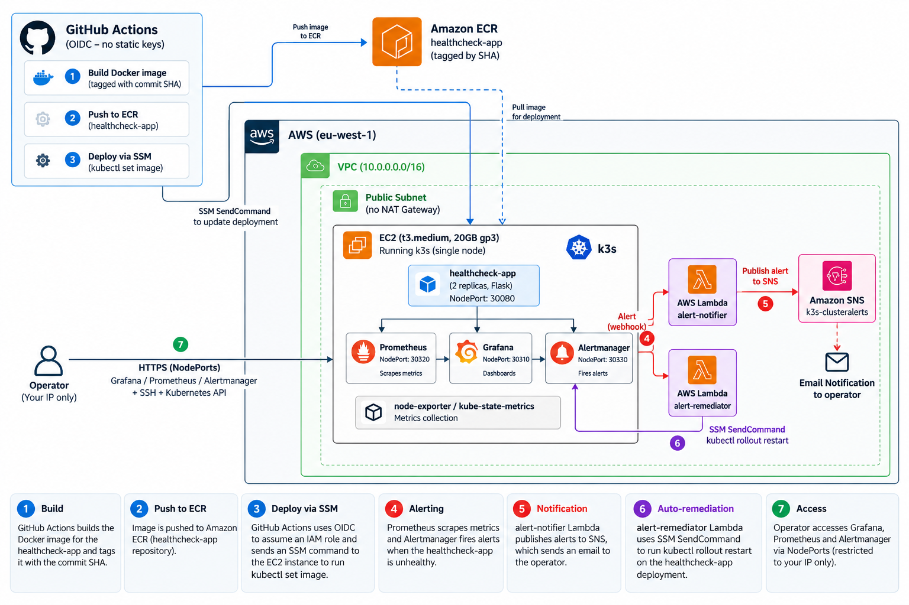

# Self-Healing AWS Infrastructure

> A production-inspired AWS/Kubernetes platform that deploys containerized workloads, monitors their health, generates alerts, and performs automated remediation.

Built with **Terraform, AWS, k3s, Prometheus, Grafana, Alertmanager, Lambda, Systems Manager, ECR, and GitHub Actions**.

This project was built to go beyond simply deploying an application. The goal was to explore the operational side of cloud infrastructure: **deployment, observability, failure detection, incident response, automated remediation, security, and troubleshooting.**

---

## Architecture




The infrastructure runs in **AWS eu-west-1** inside a custom VPC. A single EC2 instance hosts a lightweight k3s cluster containing the application and monitoring stack.

---

## What This Project Demonstrates

The project brings several parts of a cloud platform together rather than treating them as isolated exercises:

- Infrastructure provisioning with Terraform
- Containerized application deployment on Kubernetes
- CI/CD without long-lived AWS credentials
- Private container image storage in Amazon ECR
- Kubernetes deployment through AWS Systems Manager
- Infrastructure and Kubernetes observability
- Prometheus-based alerting
- SNS email notifications
- Event-driven remediation using Lambda
- Failure injection and incident analysis
- Cost-aware AWS architecture
- Troubleshooting across Kubernetes, Linux, IAM, ECR, networking, and AWS services

---

## Architecture Components

### Infrastructure

Terraform provisions the AWS infrastructure, including:

- VPC — `10.0.0.0/16`
- Public subnet
- Internet Gateway and routing
- Security groups
- EC2 instance
- IAM roles and instance profile
- Amazon ECR repository
- Lambda functions
- SNS topic and subscription
- GitHub OIDC provider and deployment role

Terraform state is stored remotely in Amazon S3 with DynamoDB-based state locking.

### Kubernetes

The EC2 instance runs **k3s**, a lightweight Kubernetes distribution.

The cluster hosts:

- `healthcheck-app` — two replicas of the Flask application
- Prometheus
- Grafana
- Alertmanager
- node-exporter
- kube-state-metrics

The application is exposed through NodePort `30080`.

For this portfolio environment, Prometheus, Grafana, and Alertmanager also use NodePorts restricted through the EC2 security group.

### Observability

The monitoring stack is deployed using `kube-prometheus-stack`.

**Prometheus** collects infrastructure and Kubernetes metrics.

**node-exporter** exposes host-level metrics such as CPU, memory, filesystem, and network statistics.

**kube-state-metrics** exposes Kubernetes object state, including pod and container status.

**Grafana** provides visualization.

**Alertmanager** receives fired Prometheus alerts and routes them to notification and remediation workflows.

---

## Self-Healing Workflow

The main remediation path is:

```text
Application failure
        │
        ▼
Prometheus detects abnormal state
        │
        ▼
PrometheusRule fires
        │
        ▼
Alertmanager
        │
        ├──────────────► Notifier Lambda
        │                       │
        │                       ▼
        │                      SNS
        │                       │
        │                       ▼
        │                     Email
        │
        └──────────────► Remediator Lambda
                                │
                                ▼
                         SSM SendCommand
                                │
                                ▼
                              EC2
                                │
                                ▼
                    kubectl rollout restart
                                │
                                ▼
                      healthcheck-app
```

One implemented rule detects repeated container restarts:

```promql
increase(kube_pod_container_status_restarts_total{namespace="default"}[15m]) > 3
```

When the alert satisfies its configured duration, Alertmanager routes it to the Lambda integrations.

The **notifier Lambda** publishes incident information to SNS.

The **remediator Lambda** sends an SSM command to the k3s node, where Kubernetes performs a rollout restart of the affected deployment.

This avoids exposing additional inbound management ports solely for Lambda-based remediation.

---

## CI/CD Pipeline

Every relevant push to `main` triggers the GitHub Actions pipeline.

```text
Developer
   │
   ▼
git push
   │
   ▼
GitHub Actions
   │
   ├── Assume AWS role using OIDC
   │
   ├── Authenticate to ECR
   │
   ├── Build Docker image
   │
   ├── Tag image with Git commit SHA
   │
   ├── Push image to ECR
   │
   └── SSM SendCommand
              │
              ▼
       kubectl set image
              │
              ▼
       Kubernetes rollout
```

### Why OIDC?

GitHub Actions does not require a long-lived AWS access key stored as a repository secret.

Instead:

```text
GitHub Actions
      │
      ▼
GitHub OIDC token
      │
      ▼
AWS STS
      │
      ▼
Temporary role credentials
```

The IAM trust policy restricts role assumption to the intended GitHub repository and branch.

### Why tag images with commit SHAs?

Images use the Git commit SHA instead of relying on `latest`.

For example:

```text
851725234293.dkr.ecr.eu-west-1.amazonaws.com/healthcheck-app:<commit-sha>
```

This provides traceability between:

```text
Git commit → CI build → ECR image → Kubernetes deployment
```

---

## Why These Design Choices?

| Decision | Reasoning |
|---|---|
| **k3s instead of EKS** | Reduced cost while retaining real Kubernetes primitives. The tradeoff is that AWS-specific integrations normally handled by EKS require more work in a self-managed cluster. |
| **Single EC2 node** | Appropriate for a portfolio/lab environment where the goal is understanding platform components rather than providing true HA. |
| **No NAT Gateway** | Avoids unnecessary NAT Gateway cost for a small public-subnet lab environment. |
| **SSM for deployment/remediation** | Allows commands to be executed on the node without exposing another inbound management interface. |
| **GitHub OIDC** | Removes the need for long-lived AWS access keys in GitHub Actions. |
| **Commit-SHA image tags** | Provides traceability from a deployed container back to source code. |
| **NodePort** | Keeps networking simple for a single-node environment without introducing a cloud load balancer. |
| **Prometheus + Alertmanager** | Provides metrics-based detection and flexible routing into AWS-based notification and remediation workflows. |

These choices are intentionally optimized for a **cost-conscious learning environment**, not presented as the ideal architecture for every production workload.

---

## Chaos Engineering

The platform was deliberately subjected to failure scenarios to test both the monitoring system and the assumptions behind the architecture.

### 1. Pod Crash Loop

A repeated container failure was introduced to test:

```text
Failure
  ↓
Prometheus
  ↓
Alertmanager
  ↓
Notification + remediation
```

This exercised the complete detection and response path, including automated SSM-triggered remediation.

### 2. CPU Exhaustion

CPU contention exposed a monitoring gap.

The workload could experience high CPU utilization without necessarily restarting, meaning a restart-count alert alone was insufficient.

The experiment demonstrated that application health cannot be inferred from container restart count alone.

Additional CPU, latency, and application-level alerting would be required for stronger coverage.

### 3. Disk Pressure

The disk-pressure experiment exposed an error in the original test design: the initial test filled a RAM-backed filesystem rather than the intended root EBS filesystem.

The failure itself became useful because it reinforced the need to understand the storage layer being tested rather than assuming that writing data automatically exercises persistent disk.

The experiments and troubleshooting process are documented in greater detail in `ARTICLE.md`.

---

## Troubleshooting Lessons

A significant part of this project was diagnosing failures rather than simply deploying resources.

One example occurred when the application moved from a locally built image to private ECR images.

The deployment initially failed with:

```text
ErrImageNeverPull
```

because the Kubernetes deployment still used:

```yaml
imagePullPolicy: Never
```

After correcting the pull policy, the error changed to:

```text
ErrImagePull
ImagePullBackOff
```

Further investigation showed an ECR authentication problem.

The node itself could successfully assume its EC2 IAM role:

```text
EC2
  ↓
Instance Profile
  ↓
k3s-node-ssm-role
  ↓
ECR permissions
```

and could request ECR authentication through the AWS CLI.

That narrowed the problem to the integration between the self-managed k3s/kubelet/container runtime and ECR credential delivery rather than the underlying IAM permission.

This reinforced a troubleshooting approach used throughout the project:

```text
Observe
   ↓
Scope
   ↓
Trace dependencies
   ↓
Form a hypothesis
   ↓
Prove or disprove it
   ↓
Make one targeted change
   ↓
Verify
```

---

## Tech Stack

| Area | Technology |
|---|---|
| Infrastructure as Code | Terraform |
| Cloud | AWS |
| Compute | EC2 |
| Kubernetes | k3s |
| Containers | Docker, containerd |
| Registry | Amazon ECR |
| CI/CD | GitHub Actions |
| CI Authentication | GitHub OIDC / AWS STS |
| Monitoring | Prometheus |
| Visualization | Grafana |
| Alerting | Alertmanager |
| Metrics | node-exporter, kube-state-metrics |
| Automation | AWS Lambda |
| Remote Execution | AWS Systems Manager |
| Notifications | Amazon SNS |
| Application | Python / Flask |

---

## Repository Structure

```text
.
├── backend.tf
├── providers.tf
├── variables.tf
├── outputs.tf
│
├── vpc.tf
├── security_groups.tf
├── ec2.tf
├── ecr.tf
├── sns.tf
├── lambda.tf
├── github-oidc.tf
│
├── terraform.tfvars.example
│
├── app.py
├── Dockerfile
├── requirements.txt
│
├── deployment.yaml
├── service.yaml
├── healthcheck-alerts.yaml
├── monitoring-values.yaml
│
├── lambda/
│   ├── notify.py
│   └── remediate.py
│
├── .github/
│   └── workflows/
│       └── build-and-push.yml
│
├── docs/
│   └── architecture.png
│
└── ARTICLE.md
```

---

## Running the Project

### Prerequisites

You will need:

- An AWS account
- AWS CLI configured locally
- Terraform `>= 1.5`
- An SSH key pair
- Your public IP/CIDR
- A notification email address

### 1. Clone the repository

```bash
git clone https://github.com/GeorgeEliWilliams/self-healing-aws-infra.git
cd self-healing-aws-infra
```

### 2. Configure Terraform variables

```bash
cp terraform.tfvars.example terraform.tfvars
```

Configure the required values in `terraform.tfvars`, including your allowed IP and alert email.

### 3. Initialize Terraform

```bash
terraform init
```

### 4. Review the infrastructure plan

```bash
terraform plan -out=tfplan
```

### 5. Provision the infrastructure

```bash
terraform apply tfplan
```

Additional Kubernetes and monitoring setup is documented in `ARTICLE.md`.

---

## Teardown

The environment is designed to be disposable when not in use.

Review the destruction plan first:

```bash
terraform plan -destroy -out=destroy.tfplan
```

Then apply it:

```bash
terraform apply destroy.tfplan
```

The ECR repository uses `force_delete = true` so that images created by the CI pipeline do not prevent repository destruction.

The remote Terraform backend should be handled separately from the workload infrastructure so that state remains available during teardown.

---

## Security Considerations

Security decisions made in the project include:

- GitHub OIDC instead of static AWS credentials
- IAM roles for EC2 and Lambda
- Security-group restrictions on administrative and NodePort access
- SSM for remote command execution
- Repository/branch restrictions in the GitHub OIDC trust policy
- No credentials committed to source control

There are also deliberate lab-environment compromises documented below.

---

## Known Limitations

### Single-node Kubernetes

The cluster has no node-level high availability.

If the EC2 instance fails, the Kubernetes workloads running on it are unavailable.

A production architecture would use multiple worker nodes across availability zones or a managed platform such as EKS.

### Private ECR Authentication with Self-Managed k3s

Using k3s on a standard EC2 instance does not provide the same out-of-the-box AWS integration as an EKS worker-node environment.

Although the EC2 IAM role can be authorized to access ECR, kubelet/containerd still requires a mechanism for obtaining registry credentials.

This became an important troubleshooting and architectural lesson during the project.

### Limited Alert Coverage

Automated remediation currently focuses on the implemented Kubernetes restart condition.

The chaos experiments showed that CPU saturation and disk pressure require additional alerting strategies.

### Mutable ECR Repository

The repository currently allows mutable tags.

Images are nevertheless tagged using Git commit SHAs to reduce ambiguity. A stronger production configuration would enforce immutable tags.

### Public Lambda Function URLs

Alertmanager invokes Lambda Function URLs configured for unauthenticated HTTP invocation.

This simplified the integration because Alertmanager does not natively perform AWS request signing, but it is not the architecture I would choose for a higher-security production environment.

---

## Cost Considerations

The project intentionally avoids several managed components that would increase the cost of a portfolio environment.

Major cost drivers are:

- EC2 compute while the instance is running
- EBS storage
- Small amounts of ECR storage

Lambda, SNS, and SSM usage is minimal at this scale.

The architecture intentionally avoids:

- NAT Gateway
- AWS Load Balancer
- Managed EKS control-plane cost

The environment can also be destroyed after testing and recreated through Terraform.

> AWS pricing changes over time. Check current AWS pricing before using the repository for cost estimates.

---

## What I Would Change for Production

A production evolution of this architecture would include:

1. **Managed or highly available Kubernetes**  
   Move to EKS or a multi-node Kubernetes architecture distributed across availability zones.

2. **Private worker nodes**  
   Place compute in private subnets and expose only required application entry points.

3. **Ingress and load balancing**  
   Replace direct NodePort exposure with an ingress/load-balancing architecture.

4. **Expanded observability**  
   Add CPU, memory, disk, latency, availability, and application-specific alerts.

5. **Stronger remediation controls**  
   Add retry limits, cooldown periods, remediation verification, and escalation when automated recovery fails.

6. **Immutable container artifacts**  
   Enforce immutable ECR tags and continue using commit-SHA-based image references.

7. **Improved secret and webhook security**  
   Replace publicly invokable remediation endpoints with a stronger authenticated event path.

8. **Multi-environment Terraform design**  
   Separate development/staging/production configuration and introduce reusable Terraform modules where appropriate.

---

## What I Learned

This project reinforced that deploying infrastructure is only one part of operating it.

The most valuable lessons came from the boundaries between systems:

- IAM permission does not automatically solve application-level authentication.
- A Kubernetes `Running` state does not prove that an application is healthy.
- Monitoring is only useful when the alert represents a meaningful failure condition.
- Automated remediation needs verification and limits, not just a restart command.
- CI/CD identity should use temporary credentials rather than long-lived secrets.
- Failure injection can reveal weaknesses in both the platform and the assumptions behind the test itself.
- Troubleshooting is primarily a process of narrowing the failure domain rather than trying commands until something works.

---

## Project Status

The live AWS environment is intentionally destroyed when not being used to avoid unnecessary cost.

The repository contains the Terraform, Kubernetes manifests, monitoring configuration, Lambda automation, and CI/CD workflow required to reproduce the project.

